# JPA Test

---

## Flow

1. Application init
2. Create `EntityManagerFactory` per database
3. `EntityManagerFactory` creates `EntityManager` per user request
4. Close `EntityManager` on end of request
    1. Return DB connection pool on close
5. Close `EntityManagerFactory` on end of WAS

## Persistence Context

> [https://docs.oracle.com/javaee/7/api/javax/persistence/EntityManager.html](https://docs.oracle.com/javaee/7/api/javax/persistence/EntityManager.html)
> `EntityManager` 인스턴스는 `Persistence Context`와 연관되어있습니다. `Persistence Context`는, 모든 영속 entity id 마다, 고유한 entity 인스턴스를 가지는, 인스턴스 집합입니다. 
> `Persistence context` 안에서 entity 인스턴스들과 그들의 lifecylce은 관리됩니다.
> `EntityManager API`는 영속된 entity 인스턴스를 생성, 그리고 제거하고, 그들의 primary key를 사용하여 탐색하며, entity들을 통한 질의를 하는데 사용됩니다.

Persistence Context는 모든 고유한 Entity를 저장 및 관리하는 환경입니다.

하지만 실제 구현제가 있는 것은 아니고 논리적인 개념으로써 존재합니다.

Persistence Context에 persist() 하는 행위는 DB에 바로 저장하는 것이 아니라, persistence context에 영속시키는 것입니다.

우리 개발자들은 EntityManager를 통하여 이 persistence context에 접근할 수 있습니다.

EntityManager마다 Persistence Context 개념이 생성됩니다.

## Entity Manager

### 종류

1. Container Managed Entity Manager
    - Servlet Container가 Entity Manager를 관리합니다. 즉, Container가 Entity Manager Factory를 사용하여 우리 대신 Entity Manager를 생성합니다.
    - 트랜잭션의 시작, rollback, commit 모두 container가 관리합니다.
        - 사용의 종료 시점에 entity manager를 close 하는 것 또한 container의 몫입니다. 우리가 직접 close하려 한다면 IllegalStateException이 나타납니다.

2. Application Managed Entity Manager
    - Container managed entity manager과는 다르게 우리가 entity manager factory를 사용하여 entity manager를 직접 생성해주어야 합니다.
    - 트랜잭션의 시작, rollback, commit, close 등 모두 개발자의 몫입니다.

### Thread Safe
   
Entity Manager Factory는 항상 thread-safe 합니다. 어디서 Entity Manager Factory 인스턴스를 불러와도 thread-safe 하게 사용할 수 있습니다.

그에 반해 Entity Manager는 thread-safe 하지 않습니다. Application managed 레벨에서는 thread-safe를 구현하는데 크게 어려움이 없습니다.

그러나 Container managed 레벨에서는 조금 미심쩍어 보입니다.

```java
@Service
public class someService{
  @PersistenceContext
  EntityManager entityManager;

  // some business logic methods...
}
```

위와 같이 EntityManager를 주입한다면 모든 로직들이 같은 entityManager를 사용할 것만 같습니다. 그러나 실제로는 Container가 EntityManager 대신 특별한 Proxy를 주입합니다.
Spring을 예로들자면, SharedEntityManagerCreator를 주입합니다.

우리가 주입된 entityManager를 사용할 때마다 이 프록시는 이미 존재하는 entityManager를 재사용하거나, 새로운 entityManager를 생성합니다.


## Entity LifeCycle

1. new / transient
    - 새로 생성한 객체가 DB에도, persistence context에도 존재하지 않는 경우 new / transient 한 상태입니다.
    - persist() 하지 않는 이상 DB에는 저장될 일이 없습니다.

2. managed
    - new / transient entity를 persist() 할 경우 managed 상태가 됩니다. 이후, persistence context에 적재되며,
      persistence context에게서 모든 관리를 받을 것입니다.
    - flush()가 호출 되면 EntityManager에 의해 Dirty Checking이 적용되어 entity들의 수정사항이 자동으로 적용됩니다.

3. detatched
    - 더이상 managed 상태가 아닌 entity들 입니다. Persistence context의 관리를 받지 않는 상태이므로, 값이 수정되더라도 dirty checking이 이루어지지 않습니다.
    - 그렇다고 detatched 된 데이터가 더이상 지속되지 않는 것은 아닙니다. 현재 세션과 분리된 상태입니다.
    - 아래 예제를 통해 detached 되었다고 Persistence Context에서 해당 데이터가 제거되는 것은 아닌것을 확인할 수 있습니다.
``` java
@Test
@Transactional
void detachedTest() {
    Vendor vendor1 = Vendor.builder()
        .name("Super Cool Vendor")
        .build();

    vendorRepository.save(vendor);

    vendorRepository.detach(vendor);

    Vendor vendor2 = vendorRepository.findById(vendor.getId());

    assertEquals(vendor2.getName(), "Super Cool Vendor");
    Assertions.assertThat(vendor2).isNotEqualTo(vendor);
    
    Vendor vendor3 = vendorRepository.findById(vendor.getId());
    
    Assertions.assertThat(vendor3).isEqualTo(vendor2);
}
``` 

4. removed

## Advantages of Persistence Context

1. 1차 캐시

2. 동일성 보장
    - Repeatable read를 application 레벨에서 지원

3. 쓰기 지연
    - persist 마다 commit 하지 않고 1차 캐시에 insert query를 저장하고 있다 flush(), commit() 이 실행되면 그제서야 db에 저장
    - jdbc batch option 가능
        - @GeneratedValue(strategy = IDENTITY)인 경우에는 batch insert 불가
        - insert 실행 후에 DB가 id를 정해주기 전까지는 모르기 때문

4. Dirty Checking

5. Lazy Loading

---

# 예제

## DB Schema

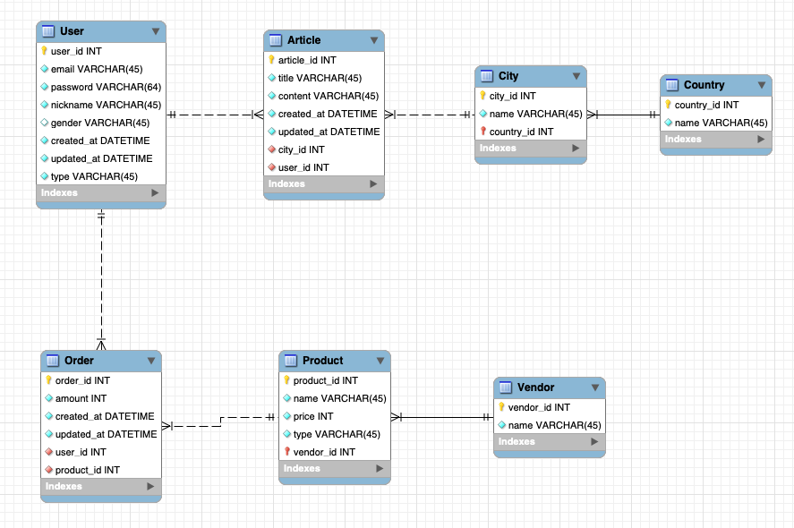

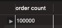

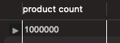

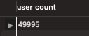

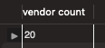

java faker를 사용하여 랜덤한 데이터를 삽입했습니다.

## JPA Entity 작성

## N + 1 문제

앞서, Entity의 relation mapping을 진행할 때, default를 EAGER LOADING으로 가지는 OOOToOne 관계들을 모두 LAZY LOADING으로 수정했었습니다.
간단한 테스트 코드를 작성하여 원하는 대로 단 한개의 쿼리를 사용하는지 확인해보았습니다.

> Session 당 몇개의 query를 사용했는지 확인하는 법
> 
> properties, yml, xml 중 사용하는 설정 파일에 아래 항목을 추가해주면 됩니다.
> `spring.jpa.properties.hibernate.generate_statistics=true`

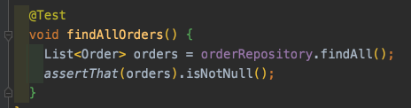

아래의 결과를 확인해보면 원하는 대로 쿼리를 한개 사용했음을 볼 수 있습니다.\
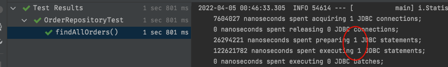

그렇다면 LAZY LOADING에서 EAGER LOADING으로 변경한다면 몇개의 쿼리나 사용할까요?

아래와 같이 Order Entity의 User 컬럼의 fetch type을 EAGER로 수정했습니다.\
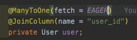

동일한 테스트 코드를 실행했을 때 결과는 아래와 같았습니다.\
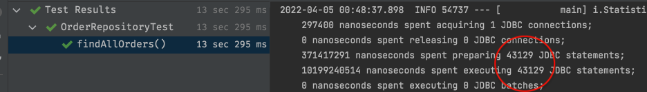

그런데 db에서 user의 전체 수를 확인해보면 아래와 같이 약 4만 9천 9백 9십 5명이 있습니다. 하지만 사용한 쿼리는 그와 동일한 49995건이 아닌 43129건 뿐이었습니다.\
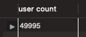

이유는 랜덤하게 데이터를 넣으면서 Order과 mapping 된 User의 수는 43128 명 뿐이기 때문입니다.
```sql
select count(distinct user_id)
from `Order`;
```

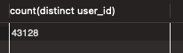

여기서 정확하게 N + 1 Problem이 발생한 것을 확인할 수 있었습니다.

Order 전체를 불러오는 데 사용한 한개의 쿼리 
    + 그 Order 당 mapping 된 User(43128)를 EAGER 하게 로딩하므로

총 43129개의 쿼리가 실행된 것입니다.

Order에 mapping 된 다른 엔티티인 Product도 동일하게 확인해보겠습니다.

아래와 같이 Product를 Eager하게 로딩하도록 설정하고,\
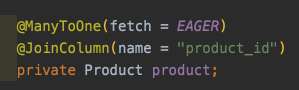

위와 동일한 테스트 코드를 실행해보면, 아래와 같은 결과가 나타났습니다.\
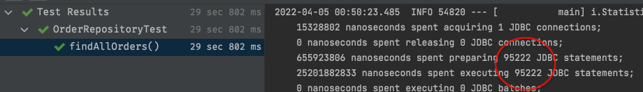

역시 랜덤한 데이터로 관계를 맺어주었기 때문에 정확히 N + 1 개의 쿼리가 실행된 것임을 확인할 수 있었습니다.\
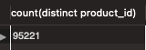


----

## 질문

1. new / transient 상태의 entity가 persist 된 후 db에 저장되는 것도 dirty checking이라고 할까요?

2. nested mapping eager loading은 왜 쿼리수 변화가 없을까요?

3. JPARepository를 extend한 interface를 생성 후 dependency injection을 한다. 그렇다면 그 interface의 구현체는 어디있나요?

4. 

